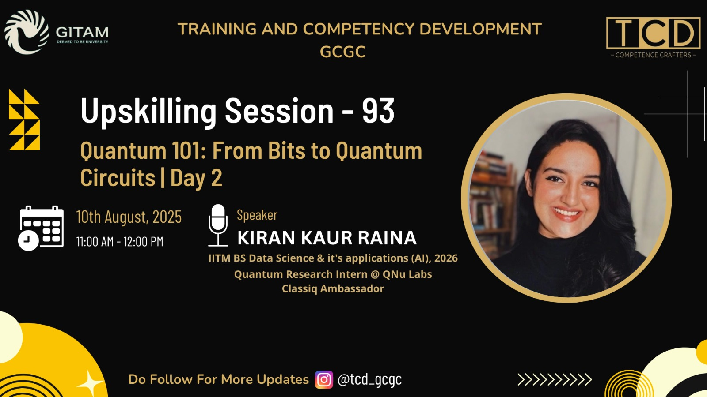

# Qiskit & Quantum Computing Workshop - GITAM University August 2025

<u><b><h2>Day 1:</u></b></h2>

<u><b><h3>Content:</u></b></h3>

India and Quantum
Bits & Qubits
Quantum vs Classical Computing
Quantum States 
Bloch Sphere
Quantum Gates 
Quantum Circuits 
Superposition & Entanglement 

<u><b><h2>Day 2:</u></b></h2>

<u><b><h3>Content:</u></b></h3>
Matrices
Quantum States
Single Qubit Gates
Multi-qubit Gates
Quantum Circuit Formation
Qiskit Coding

